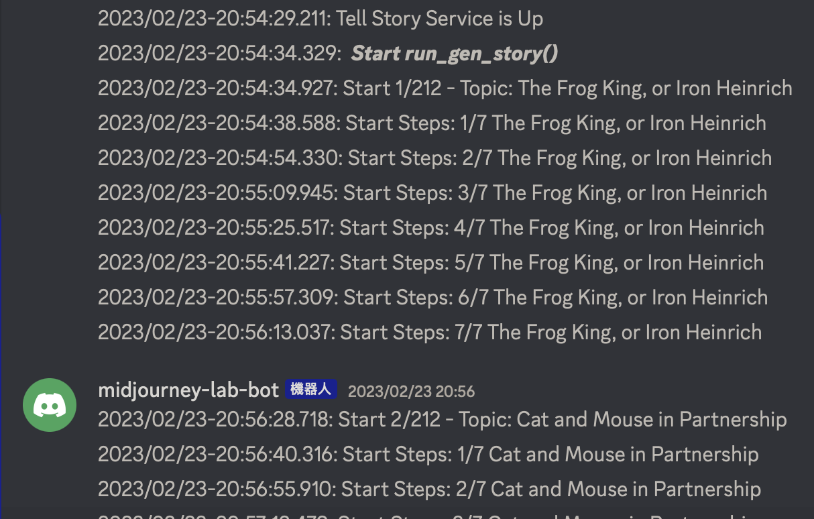

# AI-powered Bedtime Stories: From Text to Film 🌙📖🎥
Dive into the world of AI and experience the magic of automated story films, all backed by GANs and our trusty programs. Perfect for those nights when you're out of tales for the little ones.

## Video Demo
[YouTube](https://youtu.be/xowItPDmx4o)

[Blog](https://about.armcortex.cc/post/story-teller/)

## 🌟 Features:
#### Narrative Generation with ChatGPT
 - Story crafted segment-wise for easier adaptation.
 - Adjustable mood or style for each segment.
#### Lifelike Image Creation with Midjourney
 - Converts story content and style into visually captivating cover and segment images.
#### Film Assembly with FFmpeg
 - Seamlessly strings together the generated images.
 - Integrates mood-setting background tunes for a complete film experience.
#### Real-time Updates on Discord
 - Track project status: from ChatGPT's storytelling to Midjourney's image generation, all the way to downloading.
 - Powered by the Discord API for transparent monitoring.
#### Crash Recovery System
 - System hiccup? No worries! The backup's ready to pick up right where it left off.
#### Customizable Story Themes
 - Not just limited to Grimm tales.
 - Flexible parameter file to tailor the system for any story theme.

## 🚀 Get Started:
### Setup
- [config_template.yaml](./tell_a_story/config_template.yaml) Setup your configs
  - OpenAI API
  - Discord Token
  - Midjourney Bot Token
  - Midjourney Bot Session ID
  - Midjourney Bot Channel ID
- [story_settings_template.yaml](./tell_a_story/story_settings_template.yaml) Setup story series you want to tell and topics

### Usage
- Rename `config_template.yaml` to `config.yaml`
- Rename `story_settings_template.yaml` to `story_settings.yaml`
- Install `pipenv install`
- Run `pipenv run python main.py`

### Details
- [check_point.py](./tell_a_story/check_point.py) will save the process step, if process failed system will restart and `check_point.py` will restore last step and continue
- [discordbot.py](./tell_a_story/discordbot.py) will report program status

